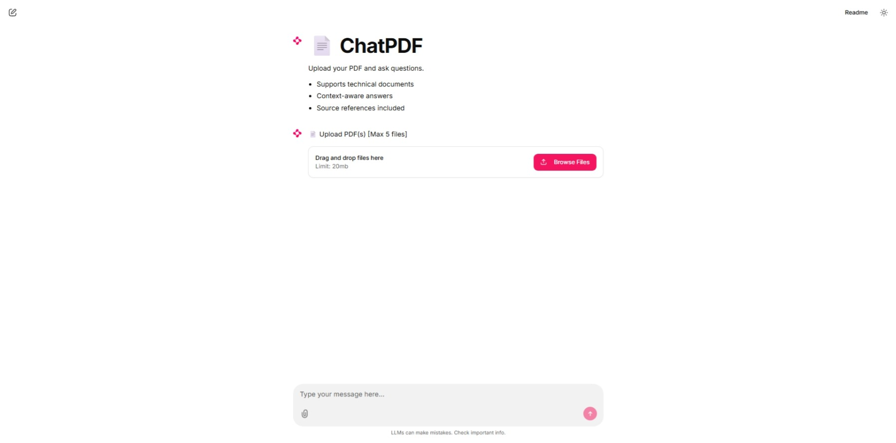
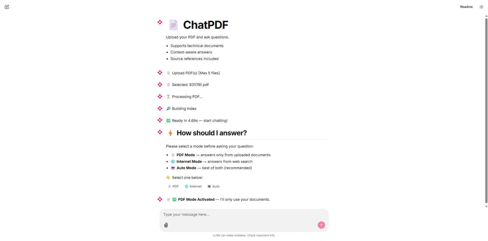
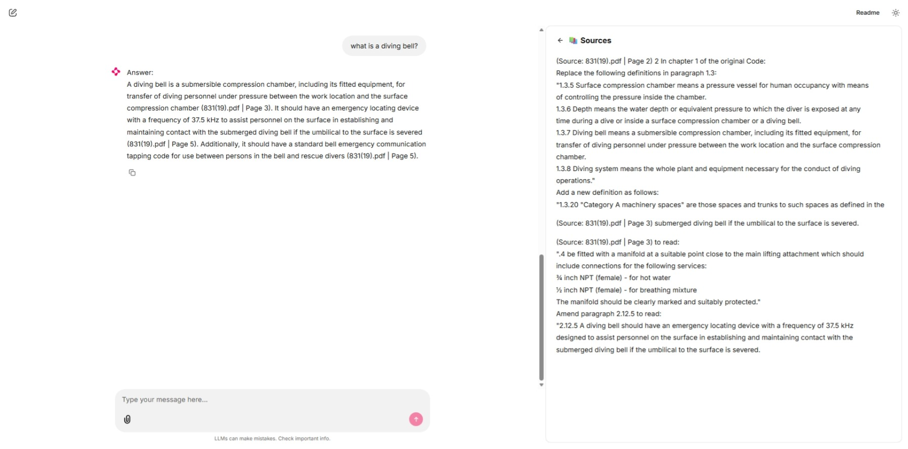

# 📄 ChatPDF + Internet RAG Assistant

> 🤖 Hybrid RAG system that intelligently switches between document knowledge and live web data.

An intelligent document assistant that allows users to query multiple PDFs and optionally enhance answers using real-time internet search.

---

## 🚀 Features

- 📄 Multi-PDF ingestion
- 🔍 RAG with reranking (FAISS + CrossEncoder)
- 🌐 Internet search fallback (DuckDuckGo)
- 🤖 Auto mode (PDF + Web hybrid answers)
- 🧠 Conversational memory
- 📚 Source attribution with page references

---

## 🧠 Modes

- **PDF Mode** → Answers strictly from documents  
- **Internet Mode** → Answers from web search  
- **Auto Mode** → Combines both intelligently  

---

## 🛠️ Tech Stack

- Transformers (Mistral-7B-Instruct)
- LangChain
- FAISS
- SentenceTransformers (CrossEncoder reranking)
- Chainlit (UI)

---

## 🧠 How it Works

User Query  
→ Intent Classification  
→ Source Routing (PDF / Internet / Auto)  
→ Retrieval (FAISS)  
→ Reranking (CrossEncoder)  
→ LLM Response Generation  

---

## 💬 Example Queries

- "Summarize the document"
- "List all risks mentioned"
- "What is the revenue growth?"
- "Explain LLMs" (Internet mode)

---

## ▶️ Run Locally

```bash
git clone https://github.com/your-username/chatpdf-rag.git
cd chatpdf-rag
pip install -r requirements.txt
chainlit run app.py
```

---

## 🎥 Demo Video

> ⚡ Demonstrates multi-PDF querying, mode switching, and hybrid (PDF + Internet) answers.

### 🎬 Quick Demo (Recommended)
[Watch Quick Demo](https://github.com/Korunil/chatpdf-rag/blob/main/assets/demo-quick.mp4)

> Includes annotations and shortened response times for clarity.

---

### 🧪 Full Demo (Raw Performance)
[Watch Full Demo](https://github.com/Korunil/chatpdf-rag/blob/main/assets/demo-full.mp4)

> Shows actual system behavior and real response latency.


## 📸 Demo (UI Walkthrough)

### Upload PDFs


### Mode Selection


### Answer with Sources


---

## ⚙️ Notes & Limitations

- Currently supports up to **5 PDFs per session** (can be increased with more compute)
- Performance depends on available hardware (tested on local GPU setup)
- Internet mode uses **DuckDuckGo Search (ddgs)** — results may vary in quality
- Demo video has shortened response times for brevity

💡 These constraints are implementation choices and can be scaled with better infrastructure.

---

## 💡 Future Improvements
- Confidence scoring for answers
- Better UI (sidebar mode selector / richer controls)
- Improved source highlighting
- Deployment (Docker / Hugging Face Spaces)
