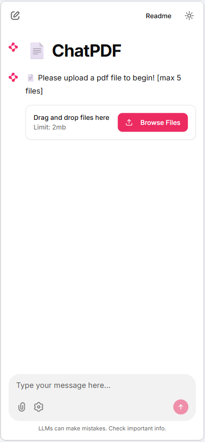
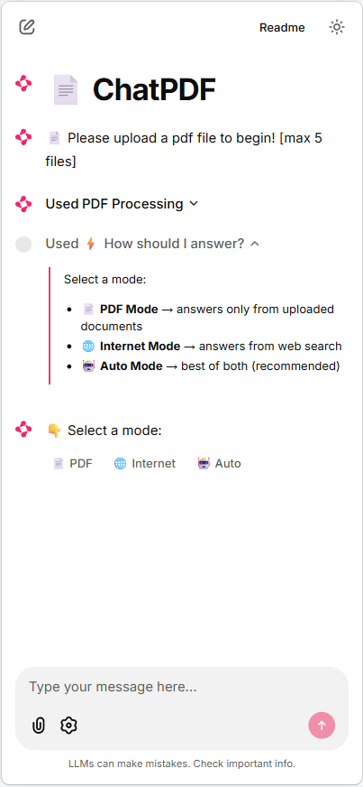
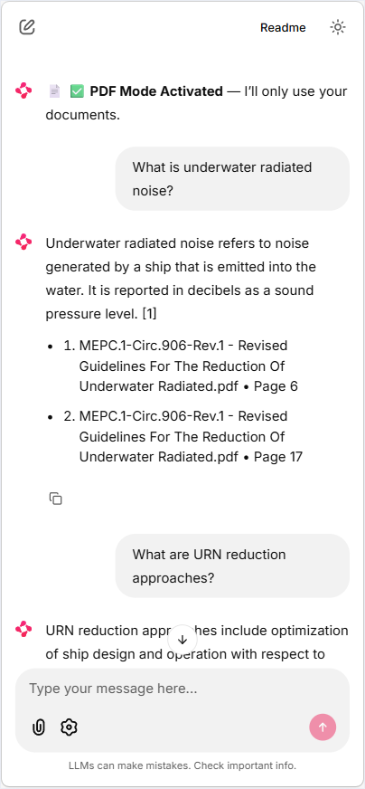

# 📄 ChatPDF + Internet RAG Assistant

An intelligent document assistant that allows users to query multiple PDFs and optionally enhance answers using real-time internet search.

## 🚀 Features

- 📄 Multi-PDF ingestion
- 🔍 RAG with reranking (FAISS + CrossEncoder)
- 🌐 Internet search fallback (DuckDuckGo)
- 🤖 Auto mode (PDF + Web hybrid answers)
- 🧠 Conversational memory
- 📚 Source attribution with page references

## 🧠 Modes

- **PDF Mode** → Answers strictly from documents  
- **Internet Mode** → Answers from web search  
- **Auto Mode** → Combines both intelligently  

## 🛠️ Tech Stack

- Transformers (Mistral-7B-Instruct)
- LangChain
- FAISS
- SentenceTransformers (CrossEncoder reranking)
- Chainlit (UI)

## ▶️ Run Locally

```bash
git clone https://github.com/your-username/chatpdf-rag.git
cd chatpdf-rag
pip install -r requirements.txt
chainlit run app.py

## 📸 Demo

### Upload PDFs


### Mode Selection


### Answer with Sources


## ⚙️ Notes & Limitations

- Currently supports up to **5 PDFs per session** (can be increased with more compute)
- Performance depends on available hardware (tested on local GPU setup)
- Internet mode uses **DuckDuckGo Search (ddgs)** — results may vary in quality
- Demo video has shortened response times for brevity

💡 These constraints are implementation choices and can be scaled with better infrastructure.