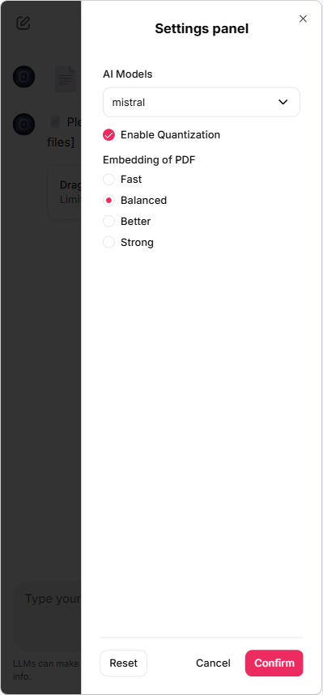

# 📄 ChatPDF v2 — Modular Hybrid RAG Assistant

> 🤖 A production-style Hybrid RAG system that answers from PDFs, the internet, or both — with intelligent routing, reranking, and grounded citations.

---

## 🚀 Overview

ChatPDF v2 is a major upgrade over the initial version — evolving from a simple RAG pipeline into a **modular, extensible system** with:

- smarter retrieval
- structured source attribution
- hybrid reasoning (PDF + Web)
- cleaner architecture for scaling

---

## 🔁 From v1 → v2 (What Changed)

| Area | v1 | v2 |
|------|----|----|
| Architecture | Single script | Modular (pipeline / rag / tools / memory) |
| Retrieval | Basic similarity | FAISS + CrossEncoder reranking |
| Sources | Loose references | Inline citations + page grounding |
| Routing | Manual | Intent-based + auto routing |
| Hybrid Mode | Basic fallback | Structured PDF + Web fusion |
| Memory | Minimal | Query-aware conversational memory |

---

## 🧱 Architecture

The system is now organized into clean, extensible modules:

```
pipeline/   → orchestration, routing, evaluation  
rag/        → ingestion, retrieval, reranking  
llm/        → response generation  
tools/      → web search, summarization  
memory/     → chat history & query rewriting  
```

This makes it easier to:
- swap components (LLMs, retrievers, rerankers)
- debug individual stages
- extend the pipeline

chatpdf-rag/
│
├── app.py
├── config.py
├── cache_store.py
├── preload_models.py
│
├── llm/          # LLM loading & generation
├── memory/       # Conversational memory
├── pipeline/     # Routing & orchestration
├── prompt/       # Prompt templates
├── rag/          # Embeddings & retrieval
├── tools/        # Web search & utilities
├── assets/       # UI images & demos
├── public/       # Icon and its images
│
└── README.md

---

## 🧠 RAG Pipeline (v2)

```
User Query
   ↓
Intent Classification
   ↓
Source Router (PDF / Internet / Auto)
   ↓
Retriever (FAISS)
   ↓
Reranker (CrossEncoder)
   ↓
Context Builder + Citations
   ↓
LLM Generation (Mistral)
   ↓
Final Response + Sources
```

> 💡 Key idea: Good RAG is not just retrieval — it’s **routing + ranking + grounding + UX**

---

## ⚙️ Features

- 📄 Multi-PDF ingestion
- 🔍 FAISS-based semantic retrieval
- 🧠 CrossEncoder reranking (BAAI/bge-reranker-base)
- 🌐 Internet fallback (DuckDuckGo)
- 🤖 Intelligent source routing (PDF / Web / Hybrid)
- 🧾 Inline citations with page references
- 💬 Conversational memory with query rewriting
- ⚡ Chainlit UI

---

## 🧠 Modes

| Mode | Behavior |
|------|--------|
| 📄 PDF | Answers strictly from documents |
| 🌐 Internet | Uses web search only |
| 🤖 Auto | Dynamically selects best source |

---

### ⚙️ User Settings (Chainlit Panel)

Users can customize system behavior via the Chainlit settings panel, enabling control over model selection, embedding quality, and performance optimizations.

#### Settings Overview

| Setting           | Options                                     | Default  | Description |
|------------------|--------------------------------------------|----------|-------------|
| **AI Model**      | mistral, mistral2, llama                   | mistral  | Choose the LLM backend for answer generation. |
| **Quantization**  | True / False                               | True     | Enable or disable model quantization to reduce memory usage. |
| **Embedding**     | Fast, Balanced, Better, Strong             | Balanced | Controls the embedding model used for PDF retrieval. |
| **Reranker**      | BAAI/bge-reranker-base (default)           | BAAI/bge-reranker-base | Cross-encoder used for reranking retrieved results (not user-configurable). |

#### Embedding Options Mapping
- **Fast:** `sentence-transformers/all-MiniLM-L6-v2`  
- **Balanced:** `BAAI/bge-base-en-v1.5`  
- **Better:** `BAAI/bge-large-en-v1.5`  
- **Strong:** `intfloat/e5-large-v2`  

#### LLM Model Mapping
- `mistral`: `mistralai/Mistral-7B-Instruct-v0.2`  
- `mistral2`: `mistralai/Mistral-7B-Instruct-v0.3`  
- `llama`: `meta-llama/Meta-Llama-3-8B-Instruct`  

#### Reranking Strategy
The reranking layer is system-controlled (configured in `config.py`, not exposed via UI):

- **Primary model:** `BAAI/bge-reranker-base`  
- **Fallback model:** `cross-encoder/ms-marco-MiniLM-L-6-v2`  
- **Execution device:** CPU (`DEVICE_RERANKER = "cpu"`)

---

## 📚 Source Attribution

- Inline citations: `[1], [2]`
- Page-level grounding from PDFs
- Reduced hallucinated references
- Structured source display

---

## 🌐 Hybrid Mode (v2 Improvement)

Instead of naive fallback, v2 uses **structured fusion**:

- PDF answer → primary grounding  
- Web answer → supplementary context  
- Graceful fallback when PDFs lack coverage  

---

## 💬 Example Queries

- "Summarize the document"
- "List all risks mentioned"
- "What is the revenue growth?"
- "Compare this with current market trends" (Hybrid)
- "Explain LLMs" (Internet mode)

---

## 🛠️ Tech Stack

- **LLM**: Mistral-7B-Instruct
- **Framework**: LangChain
- **Retrieval**: FAISS
- **Reranking**: BAAI/bge-reranker-base (via SentenceTransformers CrossEncoder)
- **Search**: DuckDuckGo (ddgs)
- **UI**: Chainlit

---

## ▶️ Run Locally

```bash
git clone https://github.com/Korunil/chatpdf-rag.git
cd chatpdf-rag
pip install -r requirements.txt
chainlit run app.py
```

---

## 🎥 Demo

### 🎬 Quick Demo (Recommended)
[Watch Quick Demo](https://github.com/Korunil/chatpdf-rag/blob/main/assets/demo-quick.mp4)

### 🧪 Full Demo (Raw Performance)
[Watch Full Demo](https://github.com/Korunil/chatpdf-rag/blob/main/assets/demo-full.mp4)

---

## 📸 UI Walkthrough

### Upload PDFs


### Settings Panel


### Mode Selection


### Answer with Sources


---

## ⚙️ Limitations

- Supports ~5 PDFs per session (configurable)
- Performance depends on local compute (tested on GPU)
- Internet search quality may vary
- Large PDFs may require tuning (chunking, retrieval params)

---

## 💡 Future Work

- Clickable citations → jump to source chunks
- Highlighted answer spans in PDFs
- Confidence scoring
- Streaming responses
- Improved UI (sidebar, collapsible sources)
- Deployment (Docker / Hugging Face Spaces)

---

## 🧠 Key Insight

> RAG is not just “retrieve + generate”

It’s:
**routing + ranking + grounding + memory + UX**

---

## 🤝 Contributing

Contributions, ideas, and feedback are welcome!

If you're working on RAG systems, I'd especially love input on:
- retrieval quality
- citation UX
- hybrid design

---

## 🔗 Repository

https://github.com/Korunil/chatpdf-rag
